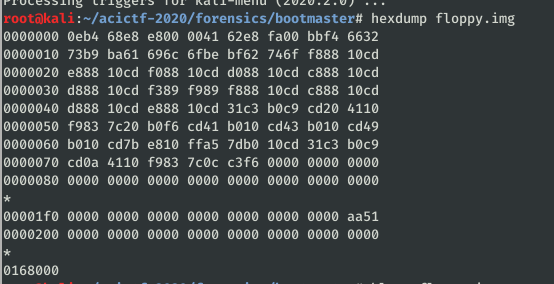
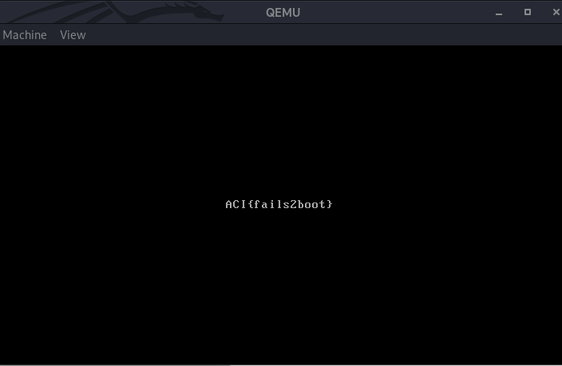

# Boot Master #

**Category:**	Forensics  
**Points:**	75

**Prompt:** 
* We found another floppy disk [image](./files.tar.gz), but we can't get this one to boot like we did the last one. The disk had been sitting around for a while so we're wondering if some of the data was corrupted. Any ideas?

**Hints:** 
* It looks like file floppy.img identifies this one as just "data"…
* How does file recognize that an image contains a [master boot record](https://en.wikipedia.org/wiki/Master_boot_record)?
* You'll probably need some kind of 'hex editor' for this problem.
* Can we change one bit in the image and fix the problem?


**Solution:**
* From this [site](http://blog.hakzone.info/posts-and-articles/bios/analysing-the-master-boot-record-mbr-with-a-hex-editor-hex-workshop/) we have identified that the MBR is identified by the magic number 0x55 0xAA located at 0x1FA
* From the hexdump, it looks like the bytes are messed up
* 
* I used hexeditor to alter the bytes
* Use qemu to boot
```
qemu-system-i386 floppy.img
```
* 
* ACI{fails2boot}
