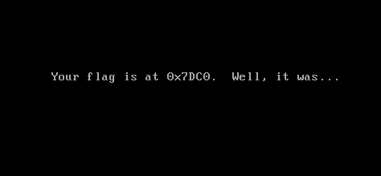
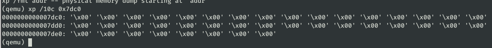
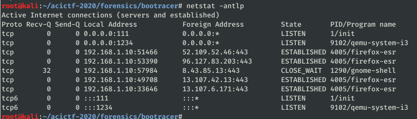
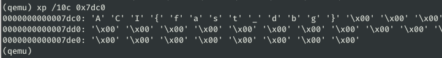

# Boot Racer #

**Category:**	Forensics  
**Points:**	150

**Prompt:** 
* We've found one last floppy disk [image](./files.tar.gz) that boots, but it looks like we're just being toyed with at this point.

**Hints:** 
* Maybe the messages aren't lying. Are they printed at the same time?

**Solution:**
* Try qemu:
    * 
* Try reading memory with:
```
qemu -monitor stdio floppy.img
```
* 
* The purged memory and the hint indicates that the flag was in memory, but memory cleared on boot.  We need to pause the machine before it has time to change memory and then read.
* Qemu debugging [docs](https://en.wikibooks.org/wiki/QEMU/Debugging_with_QEMU) give some good info
* I need to stop the instance and wait for the debugger (gdb) to connect
```
qemu-system-i386 -S -gdb tcp::1234 -monitor stdio floppy.img
```
* I can see qemu is listening for gdb to connect on port 1234
    * 
* Start gdb
* Connect to qemu from gdb:
```
target remote localhost:1234
```
* Set a breakpoint.  Lets try *0x00007c00 first.  I'm not sure where to start but lets try it just because it is before our target address.  I'll check the memory at each step of the way to check when the flag enters memory.
    * Use 'ni' to step one instruction at a time and over calls
    * I spent a while doing trial and error, and the last breakpoint I was able to set before the message had appeared was:
        * break *0x00007d6a
    * Then I steped about 1000 at a time until I saw text start appearing.  Then I checked the memory in qemu for the flag:
        * 
* ACI{fast_dbg}
