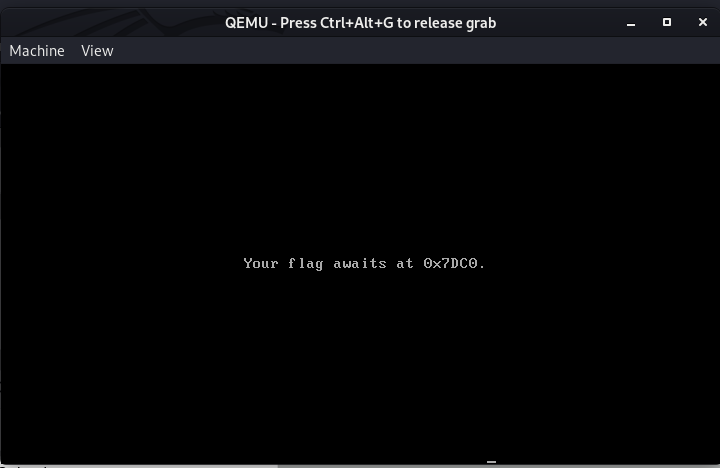
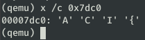

# Boot Riddle #

**Category:**	Forensics  
**Points:**	100

**Prompt:** 
* This floppy disk [image](./files.tar.gz) boots, but instead of a flag we see some silly riddle…

**Hints:** 
* If only we could inspect the device's memory while it is running…
* QEMU's [monitor](https://en.wikibooks.org/wiki/QEMU/Monitor) or Bochs' [debugger](http://bochs.sourceforge.net/doc/docbook/user/internal-debugger.html) might be useful to read up on.

**Solution:**
* Boot in qemu:
* 
* From the hint, we need to inspect the memory at 0x7DC0
* To enter monitor mode in qemu:
```
qemu-system-i386 -monitor stdio floppy.img
```
* Print memory address as chars:
    * 
* Print multiple bytes of memory:
    * 
* ACI{REALmode}
