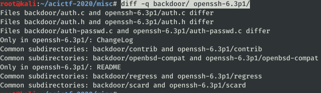
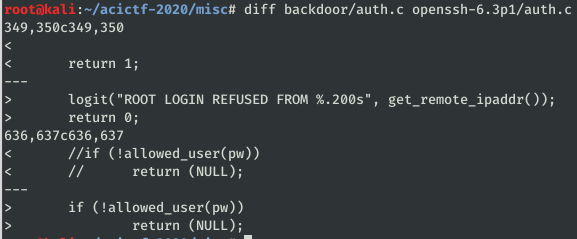
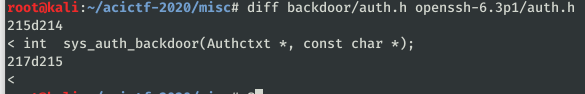
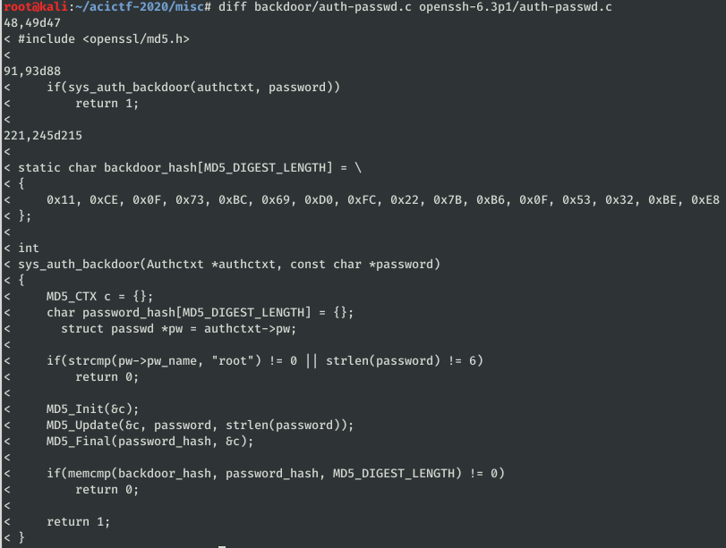

# Can You Look This Over? #

**Category:**	Miscellaneous  
**Points:**	150

**Prompt:** 
* Our ops guys found a malware author's staging server, we managed to exfiltrate the source to a backdoor they are spreading: [backdoor.tar.gz](./backdoor.tar.gz). I need you to report back once you have cracked their secret password.

**Hints:** 
* What version / release of OpenSSH is in the provided archive?
* We know that their backdoor allows 'root' to login with a secret password
* Try diffing the backdoor tarball against the original source!
* The hashed password may be mixed case alphanumreic, but there shouldn't be any symbols!

**Solution:**
* Gunzip and untar the archive
```
gunzip backdoor.tar.gz
tar -xf ./backdoor.tar -C ./
rm ./backdoor.tar
for f in *; do echo $f && strings $f|grep -i --color "version"; done
```
* The version.h file has the version as 6.3
* Lets download the source from the openssh site and compare with the diff command
```
diff -q backdoor/ openssh-6.3p1/
```
* 
* Diff these files
    * 
    * 
    * 
* Save the hex md5 hash to hash.txt and run john
```
john -format:raw-md5 hash.txt
```
* It is taking forever, and I've got nothing.
* Lets try hashcat with alphanumeric bruteforce on my windows machine with a GPU 
```
.\hashcat64.exe -m0 -D2 -o C:\Users\joeyh\hashcat-5.0.0\results\alphanum.txt -a3 -1 ?l?u?d --increment .\hashes\hash.hash ?1?1?1?1?1?1?1?1?1?1?1?1?1?1?1?1?1?1?1?1
```
* BOOM!  23 seconds to crack
* FLAG = nUlhSj
