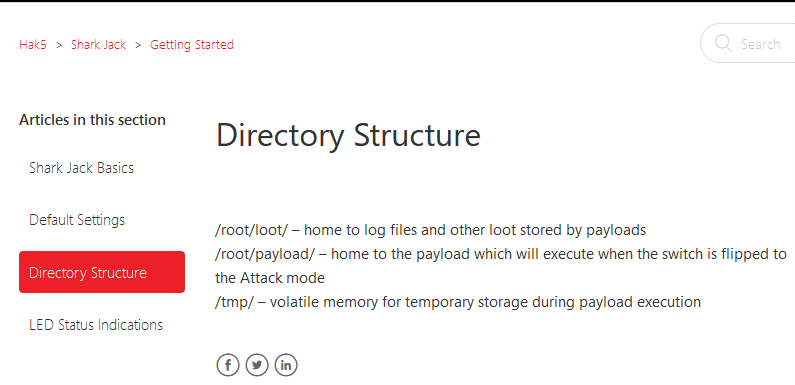
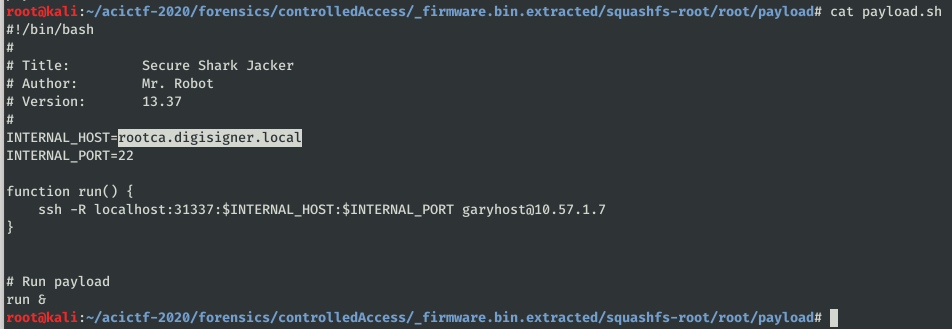

# Controlled Access #

**Category:**	Forensics  
**Points:**	50

**Prompt:** 
* We've been asked to help a certificate authority figure out what a [device](https://shop.hak5.org/products/shark-jack) they found plugged into their network was doing. They were able to dump the [firmware](./firmware.bin) and would like to know if it allowed the attacker to connect to any devices that their firewall (which blocks inbound SSH) would have stopped. Their internal domain uses 'digisigner.local' for DNS host names. The flag is the hostname of the internal host that the hacker targeted (i.e. ACI{[local hostname targeted]}).

**Hints:** 
* A tool like [binwalk](https://github.com/ReFirmLabs/binwalk) might be useful for inspecting the firmware.
* The [documentation](https://docs.hak5.org/hc/en-us/categories/360002117973-Shark-Jack) mentions that the 'attack' payload for this device lives in a very particular spot on the filesystem...

**Solution:**
* Run binwalk on the file and see the contained types
```
Binwalk -e firmware.bin
```
* The hint tells us this is a sharkjack device, and the hak5 website gives us this info on the directory structure.
* 
* 
* ACI{rootca.digisigner.local}
