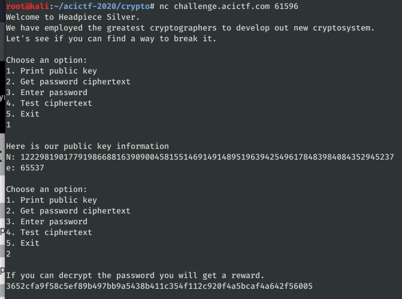
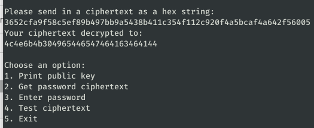

# Headpiece Silver #

**Category:**	Cryptography  
**Points:**	200

**Prompt:** 
* Can you break our unbreakable crypto? challenge.acictf.com:61596

**Hints:** 
* How large is the N that you received?
* The password is alphanumeric
* telnet is known to interact poorly with the challenge instance. We recommend using 'netcat' to connect to the challenge.

**Solution:**
* Call the server with netcat
* 
* Option 4 lets us decrypt text ciphertext.  Just put in the encrypted password they gave us
    * 
* Convert from hex to string
    * LNkK0IeDeGFAcFAD
* Enter the password
    * 
* This was probably an overlooked solution based on how easy it was.  Oh well..
* ACI{88559fc429704563d0ebef197bd}
