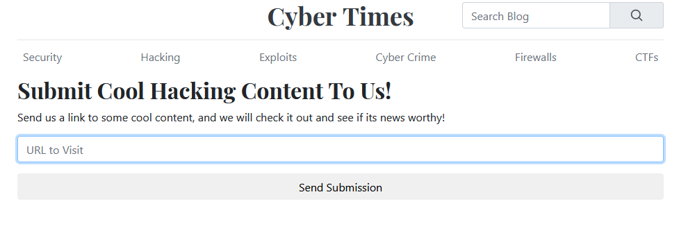
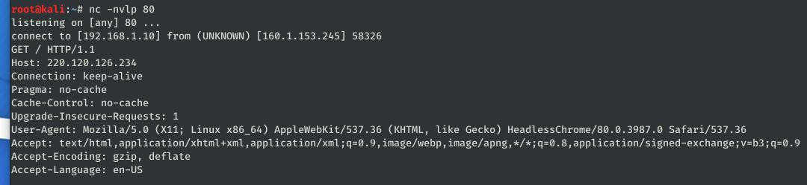
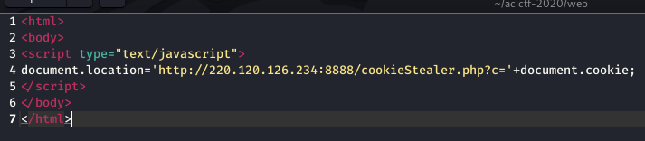
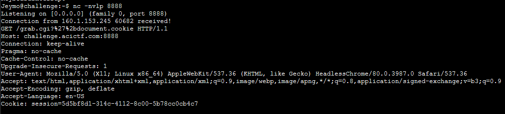

# I Have Caught You Now #

**Category:**	Web Security  
**Points:**	250

**Prompt:** 
* XSS is a thing of the past! Read all about it here: http://challenge.acictf.com:55351

**Hints:** 
* See what happens if you send XSS to the search
* This WAF might make you less secure
* Use parameter names to your advantage

**Solution:**
* XSS in the search bar is blocked by a WAF
* We can submit input here though: http://challenge.acictf.com:55351/submit
* 
* Lets set up a listener and see if they will reach out to our site:
```
nc -nvlp 80
```
* 
* Lets see if we can steal cookies
    * Send them the link to my malicious website: http://220.120.126.234/
    * Host a site that redirects cookies to my netcat listener on port 8888
    * Run "Python -m SimpleHTTPServer.py" in same directory as following index.html:
    * 
* Eureka!  Just change my session cookie to the new one!
* 
* ACI{01cabd1a0620f802c5227970d37}
