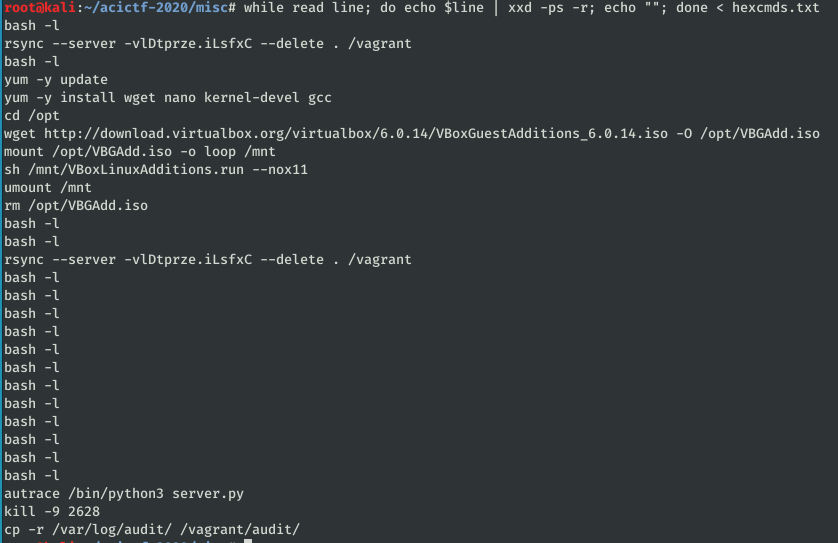
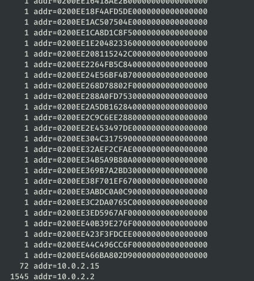
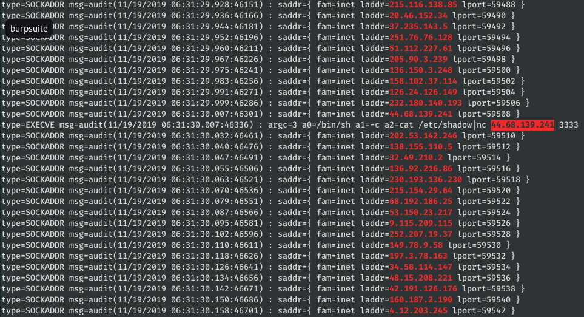

# I SEe You #

**Category:**	Miscellaneous  
**Points:**	200

**Prompt:** 
* We think someone has been attacking our web server, can you help us by finding the IP address of the attacker in our logs? [audit.log.gz](./audit.log.gz)

**Hints:** 
* The flag is the IP address of the attacker without any prefixes or braces around it.
* Audit logs can be read via the [ausearch](https://linux.die.net/man/8/ausearch) command.

**Solution:**
* Download auditd for access to ausearch
* Try to filter IPs
```
ausearch -m USER_AUTH -if audit.log
```
* None of the IPs I found work as the flag
```
cat audit.log | grep --color -E "\b([0-9]{1,3}\.){3}[0-9]{1,3}\b"
cat audit.log | grep --color -oE "\b([0-9]{1,3}\.){3}[0-9]{1,3}\b" | uniq -c | sort -bgr
```
* Try to find commands that were run
```
ausearch -m USER_AUTH -if audit.log > cmds.txt
cat cmds.txt | grep -o "cmd=.*" | grep -o "=[A-F0-9]* " | grep -o "[A-F0-9]*" > hexcmds.txt
while read line; do echo $line | xxd -ps -r; echo ""; done < hexcmds.txt
```
* 
* Pull all of a certain field.  In this case 'addr='
```
cat audit.log | grep --color -oE "addr=[^ ]*" | sort | uniq -c
```
* 
* Pull just the hex values
```
cat audit.log | grep --color -oE "addr=[^ ]*" | sort | uniq -c | egrep -o "=[A-F0-9]* ?" | grep -o "[A-F0-9]*"
```
* Nothing useful
* Print all syscalls
```
ausearch -i --start 11/19/2019 '06:30:26' -if audit.log | grep --color -o "syscall=[^ ]*" | uniq | sort | uniq -c
```
* I needed to use the '-i' option to see the data for some of the fields
```
ausearch -i --start 11/19/2019 '06:30:26' -if audit.log | egrep --color "\b([0-9]{1,3}\.){3}[0-9]{1,3}\b"
```
* Now I just scroll through to see the suspicious command 
* 
* FLAG = "44.68.139.241"
