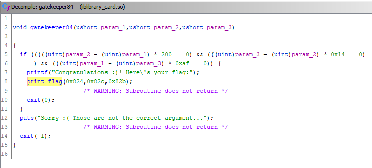
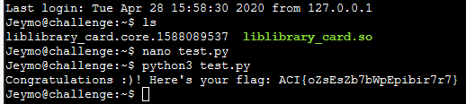

# Library Card #

**Category:**	Reverse Engineering  
**Points:**	150

**Prompt:** 
* We have recovered a [library](./liblibrary_card.so) from the target. Can you reverse engineer it to recover any hidden secret information?

**Hints:** 
* Are any functions different than the rest?
* Try cross referencing from the print_flag function :)
* If trying to link the library with your own code, double check your LD_LIBRARY_PATH!

**Solution:**
* Use Ghidra
* There are 100 gatekeeper functions and a print_flag function
* We need to find which function calls print_flag
    * Right click and click "show references to"
    * Gatekeeper84 function calls print_flag with params (hex/decimal):
        * 0x824,0x82c,0x82b
	* 2084, 2092, 2091
* 
* The original check in gatekeeper just needs to have 3 equal parameters to pass
* I know some of the static values based on params being passed.  Simplify the obfuscated code by filling in constants
* Create a python script to iterate through remaining math:
```
#!/usr/bin/python3

lenZstr = 8
i = 0
flag=""

while (i < lenZstr):
    flag = flag + str(((-90+i)^(i*-2200)^(i-1357)) % 8)
    i = i + 1
print(flag)
```
* Prints the decimals: 3575357
* In hex, this would be: 03050705030507
* Reverse the byte order and change to ascii
    * pP0PpP0
    * Didn't work like I thought
* Should have just created a program to link to the library:
```
#!/usr/bin/python3


import ctypes

# libc = ctypes.cdll.msvcrt # Windows
# libc = ctypes.CDLL('libc.dylib') # Mac
libc = ctypes.CDLL('./liblibrary_card.so') # Linux and most other *nix
libc.gatekeeper84(1,1,1)
```
* 
* ACI{oZsEsZb7bWpEpibir7r7}
