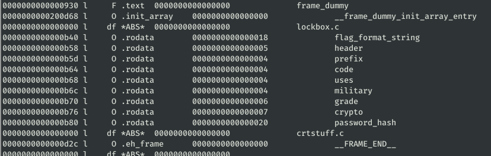
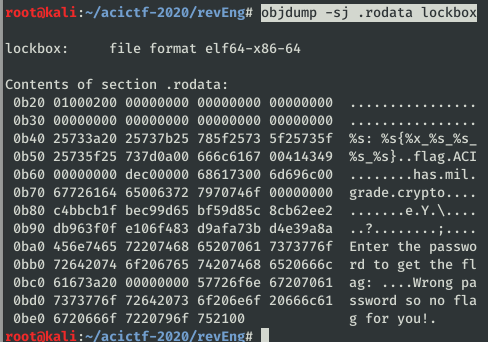
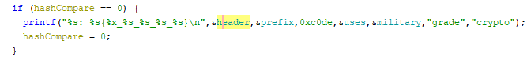
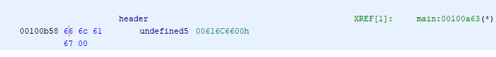

# Lockbox #

**Category:**	Reverse Engineering  
**Points:**	50

**Prompt:** 
* We developed this password-protected [program](./lockbox) which uses a super-secure, military-grade hash function with 256-bits of security to ensure only someone with the proper password can print the flag.

**Hints:** 
* You do not need to crack the password.
* Tools like [ghidra](https://ghidra-sre.org/) are helpful when strings isn't enough.
* Looking at calls to printf and puts is probably a good place to start.

**Solution:**
* Lets see the components
```
objdump -t lockbox
```
* 
* Try to view some data tables in string format
```
objdump -sj .text lockbox
objdump -sj .rodata lockbox
```
* 
* Let's Run Ghidra.  View [Ghidra quickstart & tutorial: Solving a simple crackme](https://www.youtube.com/watch?v=fTGTnrgjuGA) for a quick getting started guide.
* After decompiling the main function, find the printf statement that prints the flag.  Locate the references and double click to see the hex values they point to.
* &header = 0x666c616700 = "flag"
* 
* 
* Full flag:
    * ACI{c0de_has_mil_grade_crypto}
