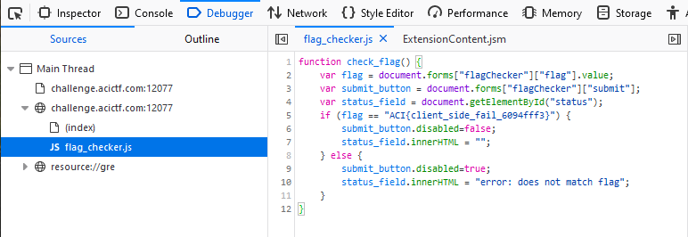

# More Out of Site #

**Category:**	Web Security  
**Points:**	10

**Prompt:** 
* Well that was embarrassing... Who knew there was more to a web site then what the browser showed? Not to worry, we're back with a new and improved Javascript version! http://challenge.acictf.com:12077 

**Hints:** 
* The Javascript code in an onInput gets called anytime you interact with a text field. 
* Is there anyway to view the Javascript definition of this function? It should just be text and your browser has it somewhere (it is running it after all). 

**Solution:**
* In firefox, right click the text field and inspect element 
* Find the script call to flag_checker.js, right click on it, and click open in debugger 
* 
* ACI{client_side_fail_6094fff3}
