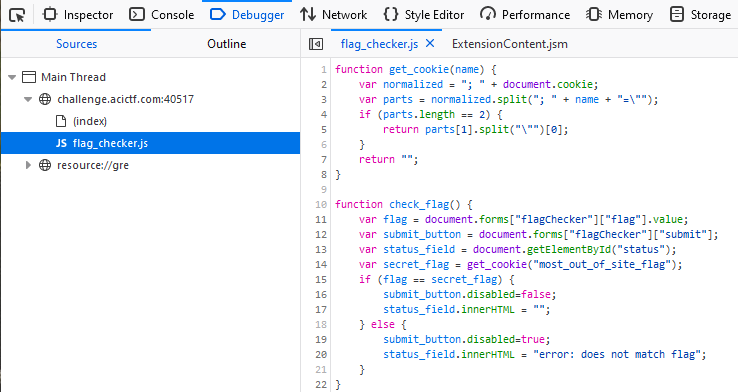

# Most Out of Site #

**Category:**	Web Security  
**Points:**	20

**Prompt:** 
* Alright, one more try. We had to think long and hard about how to keep you from viewing the flag. After a quick snack break, we had an epiphany. Your tricks won't work this time. http://challenge.acictf.com:40517 

**Hints:** 
* What on earth could [snack food](https://en.wikipedia.org/wiki/HTTP_cookie) have to do with this problem? 
* The browser must be storing these cookies somewhere… 
* If you're getting tired of using a browser, the Python [Requests](https://requests.readthedocs.io/en/master/) library is pretty useful for interacting with web servers. 

**Solution:**
* In firefox, right click the text field and inspect element
* Find the script call to flag_checker.js, right click on it, and click open in debugger
* 
* It pulls secret flag from the "most_out_of_site_flag" cookie.  Open the storage tab to view it
* ACI{cookies_fail_too_73e3859d}
