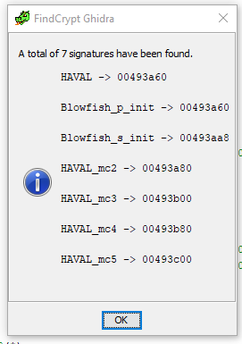

# National Dex #65 #

**Category:**	Reverse Engineering  
**Points:**	100

**Prompt:** 
* We found the encryptor ([encrypt](./encrypt)) but it won't decrypt [encrypted](./encrypted)?

**Hints:** 
* I think they're using a cipher designed by Bruce Schneier.
* When reversing, it's useful to look for magic constants or use a tool like [findcrypt](http://www.hexblog.com/?p=27) ([idapython version](https://github.com/you0708/ida/tree/master/idapython_tools/findcrypt) or [Ghidra version](https://github.com/d3v1l401/FindCrypt-Ghidra)).
* Make sure you're using CBC mode.

**Solution:**
* Using Ghidra, I Downloaded and ran findcrypt from instructions at this [link](https://github.com/d3v1l401/FindCrypt-Ghidra).
* 
* Constants
    * GLOBAL1 = 0xe2fd9c43635288fd
    * GLOBAL2 = 0xf64696d55e1a44eaf468a16787dcb72d
* It looks like it passes GLOBAL2 to the Blowfish function BF_set_key
* Then it encrypts with CBC using GLOBAL1 as the initialization vector (IV)
* Create a python script to decrypt blowfish-cbc with known iv and key:
```
#!/usr/bin/python3

import os
from Crypto.Cipher import _Blowfish
from struct import pack
import binascii

def encrypt(infilepath, outfilepath, key):
    """ Encrypt the specified file with the specified
       key and output to the chosen output file."""

    size = os.path.getsize(infilepath)
    infile = open(infilepath, 'rb')
    outfile = open(outfilepath, 'wb')
    data = infile.read()
    infile.close()

    if size % 8 > 0:  # Add padding if size if not divisible by 8
        extra = 8-(size % 8)
        padding = [0]*extra
        padding = pack('b'*extra, *padding)
        data += padding

    revdata = reversebytes(data)
    encrypted_data = encryptbytes(revdata, key)
    finaldata = reversebytes(encrypted_data)
    outfile.write(finaldata)
    outfile.close()


def encryptbytes(data, key):

    cipher = _Blowfish.new(key, _Blowfish.MODE_CBC)
    return cipher.encrypt(data)


def decrypt(infilepath, outfilepath, key, iv):
    """ Decrypt the specified file with the specified
       key and output to the chosen output file"""

    infile = open(infilepath, 'rb')
    outfile = open(outfilepath, 'wb')
    data = infile.read()
    infile.close()

    #revdata = reversebytes(data)
    revdata= data
    decrypted_data = decryptbytes(revdata, binascii.unhexlify(key), binascii.unhexlify(iv))
    #finaldata = reversebytes(decrypted_data)
    finaldata = decrypted_data
    
    #end = len(finaldata) - 1
    #while str(finaldata[end]).encode('hex') == '00':
    #    end -= 1
    #
    #finaldata = finaldata[0:end]

    outfile.write(finaldata)
    outfile.close()


def decryptbytes(data, key, iv):

    cipher = _Blowfish.new(key, _Blowfish.MODE_CBC, iv)
    return cipher.decrypt(data)


def reversebytes(data):
    """ Takes data and reverses byte order to fit
        blowfish-compat format. For example, using
        reversebytes('12345678') will return 43218765."""
    data_size = 0
    for n in data:
        data_size += 1

    reversedbytes = bytearray()
    i = 0
    for x in range(0, int(data_size/4)):
        a = (data[i:i+4])
        i += 4
        z = 0

        n0 = a[z]
        n1 = a[z+1]
        n2 = a[z+2]
        n3 = a[z+3]
        reversedbytes.append(n3)
        reversedbytes.append(n2)
        reversedbytes.append(n1)
        reversedbytes.append(n0)

    return buffer(reversedbytes)


key = "f64696d55e1a44eaf468a16787dcb72d"
iv = "e2fd9c43635288fd"
#iv = bytearray.fromhex('e2fd9c43635288fd')

decrypt('./encrypted','./decrypted',key,iv)
```
* ACI{42f99da0cd1fb5b240108d3137b}
* I'm not sure what Alakazam has to do with this problem..

