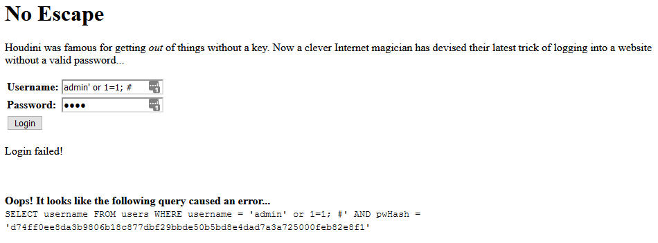
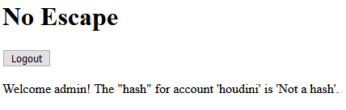
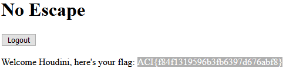

# No Escape #

**Category:**	Web Security  
**Points:**	60

**Prompt:** 
* Since in-person events are currently banned, some magician we've never heard of is trying to sell us on the idea of a "digital" magic show where the magician logs in using an impossible password. For added assurances, one lucky audience member is able to login and see the hash of the password as proof the password is impossible. We're willing to bet the secret to this magic trick is not all that complicated. http://challenge.acictf.com:28896

**Hints:** 
* Inexperienced web application developers don't always esacpe/sanitize user inputs in there database query strings. This frequently allows SQL injection attacks that result in unintended behavior.
* The developer was pretty new, so just causing the query to error out may get you more information for the exploit. What happens when you use a single ' or " in each of the login fields?
* You'll need to login as a specific user. If you're new to SQL syntax, this might be useful resource for understanding the intended query and how you can manipulate it for your purposes.

**Solution:**
* Try some SQL injection:
* 
* Based on the feedback we are getting, we just have to ensure we are commenting the entire line after.  For MySQL I believe that is '-- '
* Try admin' -- (notice trailing space) as the user and anything as the password
* 
* Now lets try the same for the houdini account
* 
* ACI{f84f1319596b3fb6397d676abf8}
