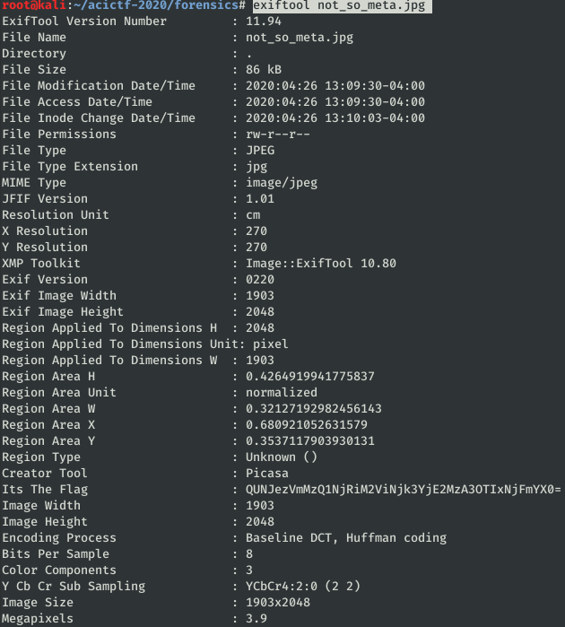

# Not So Meta #

**Category:**	Forensics  
**Points:**	50

**Prompt:** 
* Look, it's the flag! Oh wait...it looks like we need to take a closer look...
*  

**Hints:** 
* How do images keep contextual information when they're created? (e.g., GPS data, creation timestamp, etc.)
* How do you [encode](https://en.wikipedia.org/wiki/Base64) binary data into common ASCII characters?

**Solution:**
```
exiftool not_so_meta.jpg
```
* 
```
echo "QUNJezVmMzQ1NjRiM2ViNjk3YjE2MzA3OTIxNjFmYX0=" | base64 --decode
```
* ACI{5f34564b3eb697b1630792161fa}
