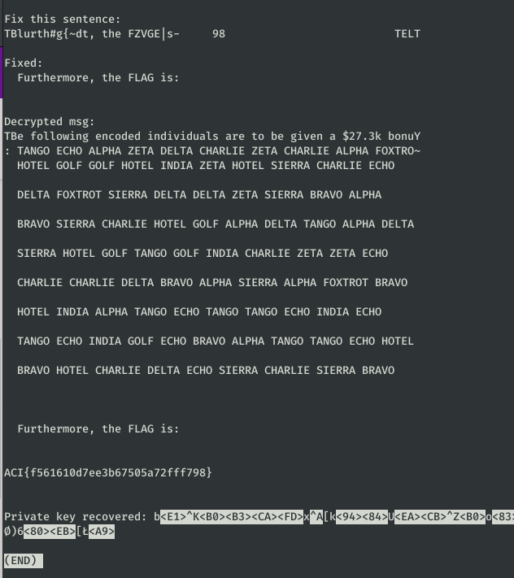

# Over Time: Paid #

**Category:**	Cryptography  
**Points:**	50

**Prompt:** 
* After many months of hard work by our agents, we've gained access to a sensitive payroll document from a competitor. Unfortunately, it looks heavily encrypted.
* document.encrypted
```
36a36e90d5a591146e2c02fae3758fa579df0be600f685fa81fe8311f1424c370a7b98058f8cbddf47bcc93b700a9801967639b81dc2f4b61a5da08934abf4f0
58c15ff1fd8db258441823dba414a69b52f14fd92182adb4a1d2b92cd4176e133809b53eaf8c93f5339f8c585f22bc28b11378d975a08bd90970cfb30f97ced7
42c143ffe78fb158461427d2a412a5875c9027cc3093a0b4acd9b131d417771e2d1ad93fa5f88cfc478de55e4531af44bb1e19ca75b986b86c75c8a47be5a1a3
42c14ff5ff9ebc58471433c0d61abeeb49f92ad13697ccd0a0dba139b57368172d1ad92daff888903497e9494522ce26aa170ed719b18fc86177a0cb7be5a1a3
42c149e2f29cb25852122ec6d614ca8852f13dcf2d93ccdcaac3b034b57062173f7bb83bbae48890239be04f5643ba25b61117b878bc93d06816c4ae1791c0a3
42c158f9f698af39211324c0c119ca8c55fc29a33097a2d3aab7b237d9710d12371fb036caef81f13592e55e3739ab30b97602dd6db1e3dd6a7ecfcb7be5a1a3
42c148f8f298b131447b28dcc507a6825f902bc62882adb4a7c5b42eda176c172913b857b9e58ce2359f8c5a5b33a625d81017c06da28ccc0974d2aa0d8aa1a3
42c143ffe78fb15848152fddc575ab874af82ea33097a2d3aab7b03bdd780d0f3815be38caf888fe20918c5e542ba144b1181cd178d086db6179a0cb7be5a1a3
42c15ff1fd8db258441823dba41ca48f53f14fc42b9aaab4a0d4bd37b5757f1a2f14d936a6fc81f1478aed55502cce30b9181fd719b580d06616c8a40f80cda3
42c142fef783bc5849143fd1c875ae8e56e42ea3379fa9c6b7d6d53bdd767f17301ed930a5e08f90239be04f5643a82ba0020ad76dd081ca6860cfcb7be5a1a3
42c149e2f29cb25849143fd1c875a9835be223ca21f6a8d1a9c3b458d07465145908b032b8fe88902496ed495b2aab44ab1f1dca6bb1e3da7b77d6a47be5a1a3
42c12b9093eadd58217b4bb4a475caeb3a904fa344f6ccb4c5b7d558b5170d7b597bd957ca8ce99047fe8c3b3743ce44d87678b819d0e3b80916a0cb7be5a1a3
42c14dc5c1be951d733604e6e179cabf72d54fc52897abb48ce4cf58b5170d7b597bd957ca8ce99047fe8c3b3743ce44d87678b819d0e3b80916a0cb7be5a1a3
42c101f1f083861e346d5aa2b5658efc7fd55ce152e1d9a4d0f6c24af3514b6c40638457ca8ce99047fe8c3b3743ce44d87678b819d0e3b80916a0cb7be5a1a3
42eb01
```
* source.py
```
#!/usr/bin/python3
import os
import binascii
import random

words = [
    "ALPHA",
    "BRAVO",
    "CHARLIE",
    "DELTA",
    "ECHO",
    "FOXTROT",
    "GOLF",
    "HOTEL",
    "INDIA",
    "SIERRA",
    "TANGO",
    "ZETA",
]

INTRO = "The following encoded individuals are to be given a $27.3k bonus:".ljust(63) + "\n"
OUTRO = "Furthermore, the FLAG is:".ljust(63) + "\n"

def divide_chunks(l, n):
    # looping till length l
    for i in range(0, len(l), n):
        yield l[i:i + n]

def encrypt_otp(data):
    d = data.encode('utf-8')
    otp = bytes(os.urandom(64))
    out = []
    for i in range(0, len(d)):
        out.append(d[i] ^ otp[i % len(otp)])
    return bytes(out)

def generate_line(length):
    out = ''
    while len(out) < length:
        out += random.choice(words) + " "

    out = out[0:length-1]
    out = ' '.join(out.split(" ")[0:-1])
    return out.ljust(length-1) + '\n'


def generate_doc(flag):
    out = INTRO

    for i in range(0,10):
        out += generate_line(64)

    out += " " * 63 + "\n"
    out += OUTRO + "\n"
    out += flag.ljust(63) + "\n"
    return out

flag = "redacted"
doc = generate_doc(flag)
enc = encrypt_otp(doc)
enc = list(divide_chunks(enc, 64))

out = b''
for line in enc:
    out += binascii.hexlify(line) + b"\n"

f = open("./document.encrypted", "wb")
f.write(out)
f.close()
```

**Hints:** 
* Isn't it strange how each line of text in their document is of an identical length?
* Key Management is a difficult problem on the battlefield; maybe they reused key material in this document?
* Previous documents we've recovered had lines of encrypted whitespace as a result of text-formatting in the plaintext... Maybe that applies to this document too?

**Solution:**
* Found a great example of cracking a reused one time pad here
    * http://dann.com.br/alexctf2k17-crypto100-many_time_secrets/
* Download the script and insert my ciphertext lines:
```
#!/usr/bin/python
## OTP - Recovering the private key from a set of messages that were encrypted w/ the same private key (Many time pad attack) - crypto100-many_time_secret @ alexctf 2017
# @author intrd - http://dann.com.br/ 
# Original code by jwomers: https://github.com/Jwomers/many-time-pad-attack/blob/master/attack.py)

import string
import collections
import sets, sys

# 11 unknown ciphertexts (in hex format), all encrpyted with the same key
c1 = "36a36e90d5a591146e2c02fae3758fa579df0be600f685fa81fe8311f1424c370a7b98058f8cbddf47bcc93b700a9801967639b81dc2f4b61a5da08934abf4f0"
c2 = "58c15ff1fd8db258441823dba414a69b52f14fd92182adb4a1d2b92cd4176e133809b53eaf8c93f5339f8c585f22bc28b11378d975a08bd90970cfb30f97ced7"
c3 = "42c143ffe78fb158461427d2a412a5875c9027cc3093a0b4acd9b131d417771e2d1ad93fa5f88cfc478de55e4531af44bb1e19ca75b986b86c75c8a47be5a1a3"
c4 = "42c14ff5ff9ebc58471433c0d61abeeb49f92ad13697ccd0a0dba139b57368172d1ad92daff888903497e9494522ce26aa170ed719b18fc86177a0cb7be5a1a3"
c5 = "42c149e2f29cb25852122ec6d614ca8852f13dcf2d93ccdcaac3b034b57062173f7bb83bbae48890239be04f5643ba25b61117b878bc93d06816c4ae1791c0a3"
c6 = "42c158f9f698af39211324c0c119ca8c55fc29a33097a2d3aab7b237d9710d12371fb036caef81f13592e55e3739ab30b97602dd6db1e3dd6a7ecfcb7be5a1a3"
c7 = "42c148f8f298b131447b28dcc507a6825f902bc62882adb4a7c5b42eda176c172913b857b9e58ce2359f8c5a5b33a625d81017c06da28ccc0974d2aa0d8aa1a3"
c8 = "42c143ffe78fb15848152fddc575ab874af82ea33097a2d3aab7b03bdd780d0f3815be38caf888fe20918c5e542ba144b1181cd178d086db6179a0cb7be5a1a3"
c9 = "42c15ff1fd8db258441823dba41ca48f53f14fc42b9aaab4a0d4bd37b5757f1a2f14d936a6fc81f1478aed55502cce30b9181fd719b580d06616c8a40f80cda3"
c10 = "42c149e2f29cb25849143fd1c875a9835be223ca21f6a8d1a9c3b458d07465145908b032b8fe88902496ed495b2aab44ab1f1dca6bb1e3da7b77d6a47be5a1a3"
c11 = "42c12b9093eadd58217b4bb4a475caeb3a904fa344f6ccb4c5b7d558b5170d7b597bd957ca8ce99047fe8c3b3743ce44d87678b819d0e3b80916a0cb7be5a1a3"
c12 = "42c14dc5c1be951d733604e6e179cabf72d54fc52897abb48ce4cf58b5170d7b597bd957ca8ce99047fe8c3b3743ce44d87678b819d0e3b80916a0cb7be5a1a3"
c13 = "42c101f1f083861e346d5aa2b5658efc7fd55ce152e1d9a4d0f6c24af3514b6c40638457ca8ce99047fe8c3b3743ce44d87678b819d0e3b80916a0cb7be5a1a3"
ciphers = [c1, c2, c3, c4, c5, c6, c7, c8, c9, c10, c11, c12, c13]
# The target ciphertext we want to crack
target_cipher = c12

# XORs two string
def strxor(a, b):     # xor two strings (trims the longer input)
    return "".join([chr(ord(x) ^ ord(y)) for (x, y) in zip(a, b)])

# To store the final key
final_key = [None]*150
# To store the positions we know are broken
known_key_positions = set()

# For each ciphertext
for current_index, ciphertext in enumerate(ciphers):
	counter = collections.Counter()
	# for each other ciphertext
	for index, ciphertext2 in enumerate(ciphers):
		if current_index != index: # don't xor a ciphertext with itself
			for indexOfChar, char in enumerate(strxor(ciphertext.decode('hex'), ciphertext2.decode('hex'))): # Xor the two ciphertexts
				# If a character in the xored result is a alphanumeric character, it means there was probably a space character in one of the plaintexts (we don't know which one)
				if char in string.printable and char.isalpha(): counter[indexOfChar] += 1 # Increment the counter at this index
	knownSpaceIndexes = []

	# Loop through all positions where a space character was possible in the current_index cipher
	for ind, val in counter.items():
		# If a space was found at least 7 times at this index out of the 9 possible XORS, then the space character was likely from the current_index cipher!
		if val >= 7: knownSpaceIndexes.append(ind)
	#print knownSpaceIndexes # Shows all the positions where we now know the key!

	# Now Xor the current_index with spaces, and at the knownSpaceIndexes positions we get the key back!
	xor_with_spaces = strxor(ciphertext.decode('hex'),' '*150)
	for index in knownSpaceIndexes:
		# Store the key's value at the correct position
		final_key[index] = xor_with_spaces[index].encode('hex')
		# Record that we known the key at this position
		known_key_positions.add(index)

# Construct a hex key from the currently known key, adding in '00' hex chars where we do not know (to make a complete hex string)
final_key_hex = ''.join([val if val is not None else '00' for val in final_key])
# Xor the currently known key with the target cipher
output = strxor(target_cipher.decode('hex'),final_key_hex.decode('hex'))

print "Fix this sentence:"
print ''.join([char if index in known_key_positions else '*' for index, char in enumerate(output)])+"\n"

# WAIT.. MANUAL STEP HERE 
# This output are printing a * if that character is not known yet
# fix the missing characters like this: "Let*M**k*ow if *o{*a" = "cure, Let Me know if you a"
# if is too hard, change the target_cipher to another one and try again
# and we have our key to fix the entire text!

#sys.exit(0) #comment and continue if u got a good key

target_plaintext = "  Furthermore, the FLAG is:".ljust(63) + "\n"
#target_plaintext = ": TANGO ZETA ALPHA ZETA ZETA CHARLIE ZETA CHARLIE ALPHA FOX   "
print "Fixed:"
print target_plaintext+"\n"

key = strxor(target_cipher.decode('hex'),target_plaintext)

print "Decrypted msg:"
for cipher in ciphers:
	print strxor(cipher.decode('hex'),key)

print "\nPrivate key recovered: "+key+"\n"
```
* 
* ACI{f561610d7ee3b67505a72fff798} 


