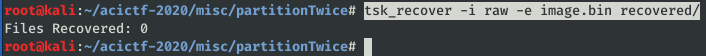
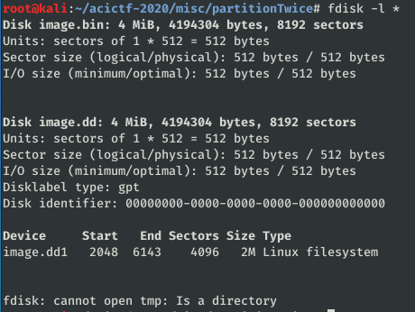
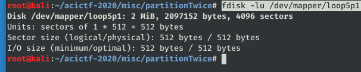
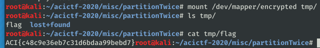

# Partition Twice, Recover Once #

**Category:**	Miscellaneous  
**Points:**	250

**Prompt:** 
* I think I may have overwritten my secure file store, do you think you could recover the data for me? The password for the encrypted partition is "secret1234". [](./image.bin)

**Hints:** 
* What is the current format of the image?
* What data is leftover from the original partition?
* Look at the last chunk of data in the image

**Solution:**
```
img_stat image.bin
mmls -i raw image.bin
fls image.bin
```
* 
```
tsk_recover -i raw -e image.bin recovered/
```
* 
* Run testdisk to recover partition table
```
fdisk -l *
```
* 
```
losetup /dev/loop5 image.dd
kpartx -a /dev/loop5
```
* This will prompt for password to decrypt
* Kpartx drops the partition link in /dev/mapper/loop5p1
```
fdisk -lu /dev/mapper/loop5p1
```
* 
```
cryptsetup --decrypt open /dev/mapper/loop7p1 --header /dev/mapper/loop7p1 encrypted
mount /dev/mapper/encrypted tmp/
```
* Tmp dir now has flag
* 
* ACI{c48c9e36eb7c31d6bdaa99bebd7}
