# PassThis #

**Category:**	Miscellaneous  
**Points:**	250

**Prompt:** 
* Passing unit tests is harder than it looks. Use our sender: [send.sh](./send.sh), to test your code. Here's a base that you can start with [start_tools.c](./start_tools.c), and the header file it's based on: [mytools.h](./mytools.h). Go start the challenge!

**Hints:** 
* Some string functions are REALLY unsafe, you should be able to find them online
* Using null pointers is usually bad news, checking for them is important

**Solution:**
* The send.sh file sends the source code to the server for testing.
* Sending the default code fails the first test, which is making a tool
    * Looking at the code, we need to adjust the fabricateTool function
        * Change vulnerable sprintf to snprintf
        * Change t->durability = 0; to t->durability = tdur;
        * 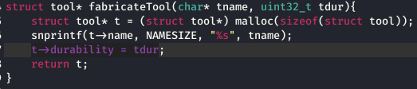
* Try to send it again
    * 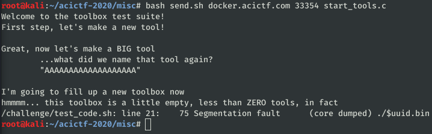
* We passed the first function test, now on to the other functions.
* assembleToolbox function
    * Original:
    * 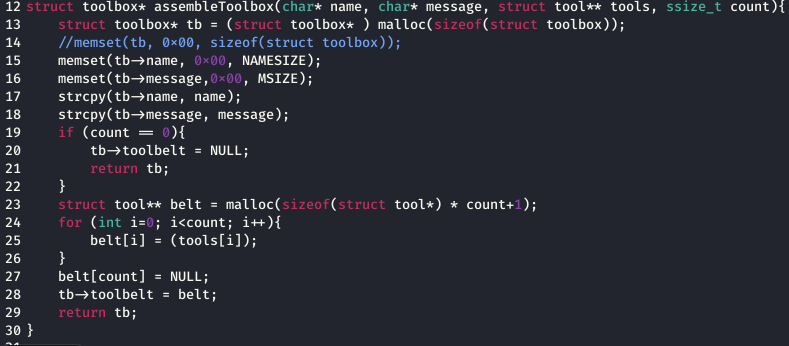
    * Need to change the check for if count ==0 to if count <=0
    * 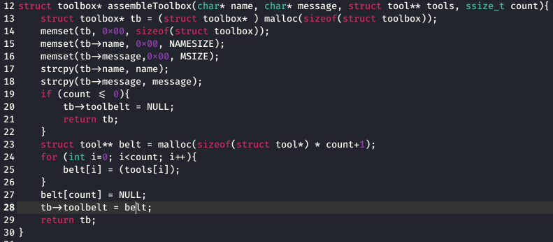
* fillNewToolbox function
    * Original:
    * 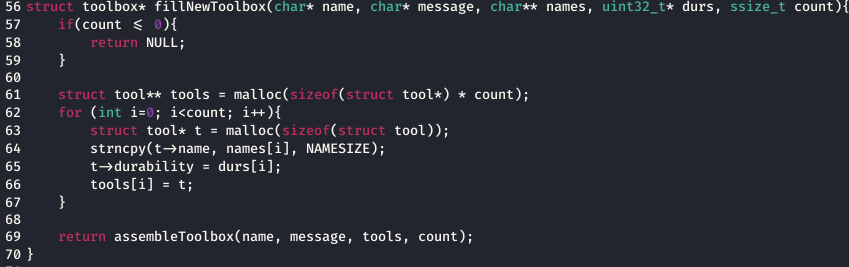
    * Just use out fabricateTool function to make new tools
    * 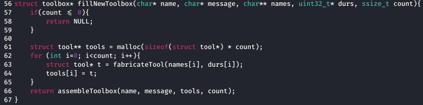
* checkToolbox function
    * Original:
    * 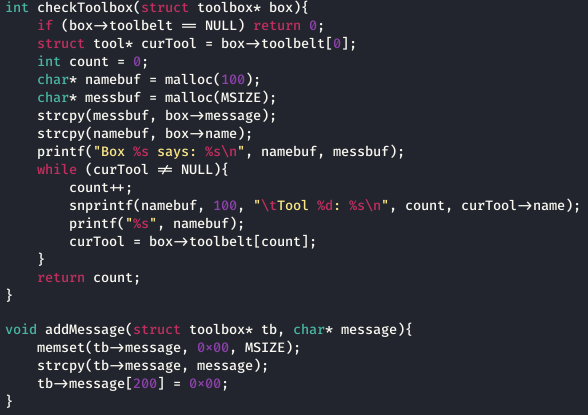
    * New:
    * 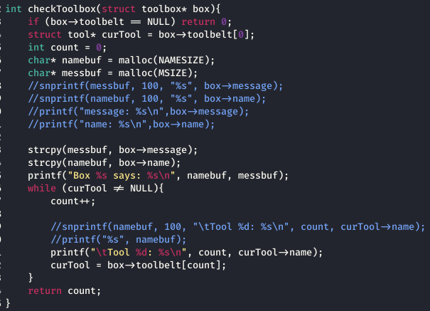
* addMessage function
    * Original:
    * 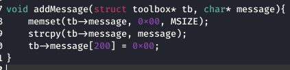
    * Strcpy function was creating a segmentation error (it's dangerous with memory)
    * 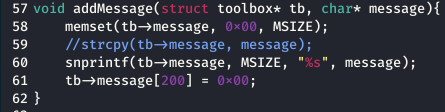
* assignTool function
    * Original:
    * 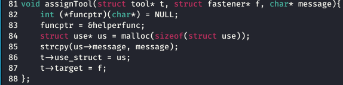
    * New:
    * 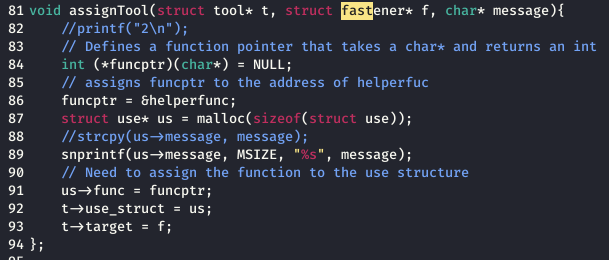
* useTool function
    * Original:
    * 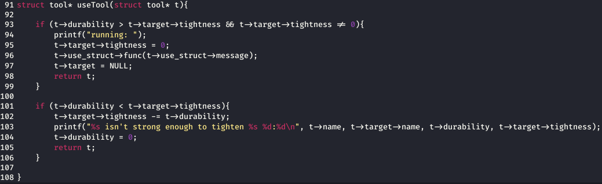
    * New:
    * 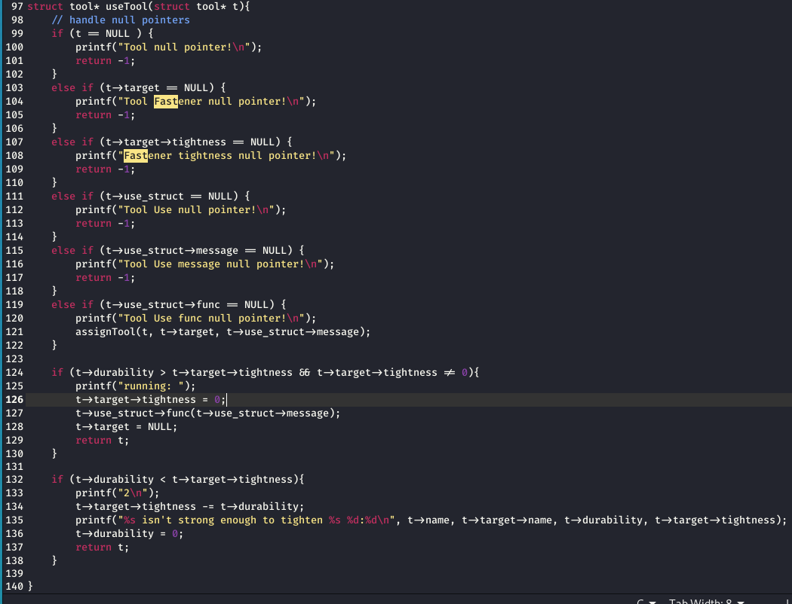
```
#include "mytools.h"
#include <string.h>

struct tool* fabricateTool(char* tname, uint32_t tdur){
    struct tool* t = (struct tool*) malloc(sizeof(struct tool));
    snprintf(t->name, NAMESIZE, "%s", tname);
    t->durability = tdur;
    return t;
}


struct toolbox* assembleToolbox(char* name, char* message, struct tool** tools, ssize_t count){
    struct toolbox* tb = (struct toolbox* ) malloc(sizeof(struct toolbox));
    memset(tb, 0x00, sizeof(struct toolbox));
    memset(tb->name, 0x00, NAMESIZE);
    memset(tb->message,0x00, MSIZE);
    strcpy(tb->name, name);
    strcpy(tb->message, message);
    if (count <= 0){
        tb->toolbelt = NULL;
        return tb;
    }
    struct tool** belt = malloc(sizeof(struct tool*) * count+1);
    for (int i=0; i<count; i++){
        belt[i] = (tools[i]);
    }
    belt[count] = NULL; 
    tb->toolbelt = belt;
    return tb;
}

int checkToolbox(struct toolbox* box){
    if (box->toolbelt == NULL) return 0;
    struct tool* curTool = box->toolbelt[0];
    int count = 0;
    char* namebuf = malloc(NAMESIZE);
    char* messbuf = malloc(MSIZE);
    //snprintf(messbuf, 100, "%s", box->message);
    //snprintf(namebuf, 100, "%s", box->name);
    //printf("message: %s\n",box->message);
    //printf("name: %s\n",box->name);
    
    strcpy(messbuf, box->message);
    strcpy(namebuf, box->name);
    printf("Box %s says: %s\n", namebuf, messbuf);
    while (curTool != NULL){
        count++;
        
        //snprintf(namebuf, 100, "\tTool %d: %s\n", count, curTool->name);
        //printf("%s", namebuf);
        printf("\tTool %d: %s\n", count, curTool->name);
        curTool = box->toolbelt[count];
    }
    return count;
}

void addMessage(struct toolbox* tb, char* message){
    memset(tb->message, 0x00, MSIZE);
    //strcpy(tb->message, message);
    snprintf(tb->message, MSIZE, "%s", message);
    tb->message[200] = 0x00;
}

struct toolbox* fillNewToolbox(char* name, char* message, char** names, uint32_t* durs, ssize_t count){
    if(count <= 0){
        return NULL;
    }

    struct tool** tools = malloc(sizeof(struct tool*) * count);
    for (int i=0; i<count; i++){
        struct tool* t = fabricateTool(names[i], durs[i]);
        tools[i] = t;
    }
    return assembleToolbox(name, message, tools, count);
}

int helperfunc(char* message){
    printf("%s\n", message);
}

void assignTool(struct tool* t, struct fastener* f, char* message){
    //printf("2\n");
    // Defines a function pointer that takes a char* and returns an int
    int (*funcptr)(char*) = NULL;
    // assigns funcptr to the address of helperfuc
    funcptr = &helperfunc;
    struct use* us = malloc(sizeof(struct use));
    //strcpy(us->message, message);
    snprintf(us->message, MSIZE, "%s", message);
    // Need to assign the function to the use structure
    us->func = funcptr;
    t->use_struct = us;
    t->target = f;
};


struct tool* useTool(struct tool* t){
    // handle null pointers
    if (t == NULL ) {
        printf("Tool null pointer!\n");
        return -1;
    }
    else if (t->target == NULL) {
        printf("Tool Fastener null pointer!\n");
        return -1;
    }
    else if (t->target->tightness == NULL) {
        printf("Fastener tightness null pointer!\n");
        return -1;
    }
    else if (t->use_struct == NULL) {
        printf("Tool Use null pointer!\n");
        return -1;
    }
    else if (t->use_struct->message == NULL) {
        printf("Tool Use message null pointer!\n");
        return -1;
    }
    else if (t->use_struct->func == NULL) {
        printf("Tool Use func null pointer!\n");
        assignTool(t, t->target, t->use_struct->message);
    }
    
    if (t->durability > t->target->tightness && t->target->tightness != 0){
        printf("running: ");
        t->target->tightness = 0;
        t->use_struct->func(t->use_struct->message);
        t->target = NULL;
        return t;
    }

    if (t->durability < t->target->tightness){
        printf("2\n");
        t->target->tightness -= t->durability;
        printf("%s isn't strong enough to tighten %s %d:%d\n", t->name, t->target->name, t->durability, t->target->tightness);
        t->durability = 0;
        return t;
    }

}
```
* ACI{3886186fe15bf0d22609cab0ff2}
