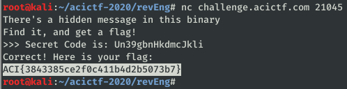

# Read it and Weep #

**Category:**	Reverse Engineering  
**Points:**	100

**Prompt:** 
* We've found a mysterious binary lying around... Can you read it's secrets? challenge.acictf.com:21045 [read_it](./read_it)

**Hints:** 
* There are two parts to the hidden message...
* A disassembler will help you make sense of the obfuscation
* A XOR B = C ::: A = C XOR B

**Solution:**
* Run Ghidra
* I found the following constants:
    * Key = 0x30313233343536373839303132333435 = "0123456789012345"
    * Secret1 = 0x4472746572633754787372377e642d37 = "Drterc7Txsr7~d-7"
    * Secret2 = 0x566d303a64616d4b68676e6049686f6a = "Vm0:damKhgn`Ihoj"
* After looking at the obfuscated code in Ghidra and manually de-obfuscating it for forever, I discovered it just xors each input character with 0x17 to encode the user input. Then it compares this with secret 1.
* User input to match secret 1 must be:
    * "Secret Code is: "
* For the function secret2, the program iterates over the 16 char 'key' string listed above, and bit shifts each right by 4.
    * Shifted key = 0x03030303030303030303030303030303
    * I can test this with a bitshift python script:
```
#!/usr/bin/python3

key = "0123456789012345"
shifted = ""
for i in key:
    print("hex "+hex(ord(i)))
    print("  ord: "+str(ord(i)))
    shifted += str(ord(i) >> 4)
print(shifted)
```
* Since secret2 just xors the parameter with each index of key, we can xor the secret2 data to reverse it.
* User input to match secret 2 must be:
    * "Un39gbnHkdmcJkli"
* Send the total string to the server:
* 
* ACI{3843385ce2f0c411b4d2b5073b7}
