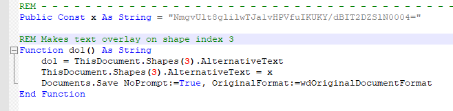
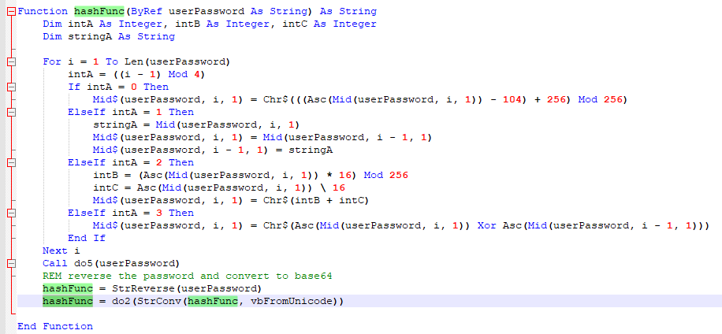
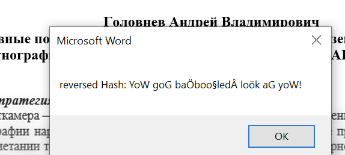
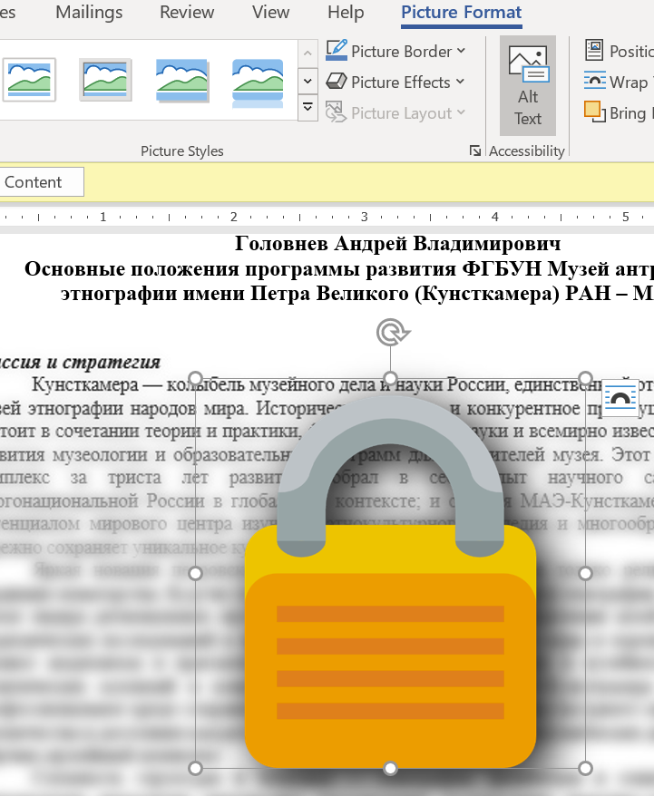
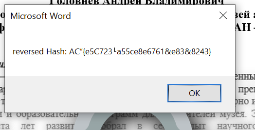
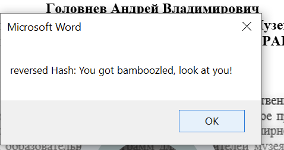
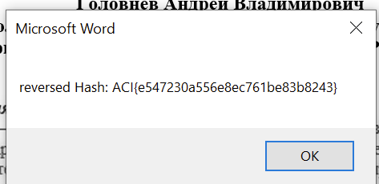

# Say What? #

**Category:**	Reverse Engineering  
**Points:**	200

**Prompt:** 
* We intercepted some foreign documents. We think there's interesting information inside but the file is protected with a unique password algorithm: [chall.docm](./chall.docm)

**Hints:** 
* Microsoft Office documents sometimes carry with them a powerful set of macros
* Microsoft Office is not required to extract the malicious macro, or solve the challenge
* There are a number of open source security tooling to script the extraction of Office macros
* The macro's obfuscation is rather light, try inserting some MsgBox prints to make sense of what it is doing
* If you're not careful, the document might ... change itself. Double check that your solution works against a 'fresh' copy of the challenge.

**Solution:**
* Install oletools
```
pip3 install -U oletools
```
* See this [reference](https://isc.sans.edu/forums/diary/Word+maldoc+yet+another+place+to+hide+a+command/24370/).
* Use olevba to extract entire scripts
   * 
* The hash is equal to the alternative text of shape 3 which is:
```
NmgvUlt8glilwTJa1vHPVfuIKUKY/dBIT2DZSlN0004=
```
* Looking at the code, the custom hash function is as follows:
    * 
* The last things it does is reverse the string and convert to base64 in the do2() function
* Lets start stepping back the other hash
* Hex
```
36 68 2f 52 5b 7c 82 58 a5 c1 32 5a d6 f1 cf 55 fb 88 29 42 98 fd d0 48 4f 60 d9 4a 53 74 d3 4e
```
* Reversed
```
4e d3 74 53 4a d9 60 4f 48 d0 fd 98 42 29 88 fb 55 cf f1 d6 5a 32 c1 a5 58 82 7c 5b 52 2f 68 36
```
* The rest of the algorithm depends on the index of the password.  See python code for logic:
```
#!/usr/bin/python3
import base64

def decimalToB64(dec):
    i = int(dec)
    b64 = base64.b64encode(i.to_bytes((i.bit_length() + 7) // 8, byteorder='big'))
    return b64.decode()

def decimalToRaw(dec):
    b64 = decimalToB64(dec)
    raw = base64.b64decode(b64).decode()
    return raw

# Convert a number from base 'b' to base10
def toDecimal(s, fromBase):
    llen = len(s)
    power = 1
    num = 0
    # force any hex input to uppercase
    if fromBase == 16:
        s = s.upper()
    elif fromBase == 64:
        return int.from_bytes(base64.b64decode(s), 'big')
    elif fromBase == 0:
        # make sure the string is converted to bytes from raw string format
        stringBytes = s.encode("raw_unicode_escape")
        # convert to base64 with existing function and then to decimal
        # not pretty but it works    
        return toDecimal(base64.b64encode(stringBytes),64)
    
    # Decimal equivalent is str[len-1]*1 + str[len-2]*base + str[len-3]*(base^2) + ...
    for i in range(llen - 1, -1, -1):
        # Each digit must be less than the orginal base
        if val(s[i]) >= fromBase:
            print('Invalid Number')
            return -1
        num += val(s[i]) * power
        power = power * fromBase
    # returns int
    return num;

    
def s2b64(s):
    return base64.b64encode(s.encode("raw_unicode_escape")).decode()
    #decimalToB64(toDecimal(s,0))

def b642s(s):
    x = base64.b64decode(s.encode("raw_unicode_escape"))
    return x.decode("raw_unicode_escape")
    #return decimalToRaw(toDecimal(s,64))

def do5(text):
    textList = list(text)
    for i in range(0,len(text)):
        textList[i] = chr(ord(textList[i]) ^ ((32 + i) % 256))
    return ''.join(textList)
        
def reverse5(text):
    textList = list(text)
    for i in range(0,len(text)):
        textList[i] = chr(ord(textList[i]) ^ ((32 + i) % 256))
    return ''.join(textList)


def hashPass(password):
    chrList = list(password)
    for i in range(0,len(chrList)):
        intA = ((i-1) % 4)
        if intA == 0:
            chrList[i] = chr(((ord(chrList[i]) - 104) + 256) % 256)
        elif intA == 1:
            stringA = chrList[i]
            chrList[i] = chrList[i-1]
            chrList[i-1] = stringA
        elif intA == 2:
            intB = (ord(chrList[i]) * 16) % 256
            intC = ord(chrList[i]) / 16
            chrList[i] = chr(int(intB + intC))
        elif intA == 3:
            chrList[i] = chr(ord(chrList[i]) ^ ord(chrList[i-1]))
    newPass = ''.join(chrList)
    #passwordChange1 = do5(newPass)
    newPass = do5(newPass)
    #reverse the password and convert to base64
    hashed = newPass[::-1]
    strHash = s2b64(hashed)
    return strHash
    

    
def revHash(x):
    convertToStr = b642s(x)
    #print(convertToStr)
    reverseStr = convertToStr[::-1]
    #print(reverseStr)
    chrList = list(reverse5(reverseStr))
    #print(chrList)
    for i in range(len(chrList)-1,-1,-1):
        intA = ((i-1) % 4)
        #print("i: "+str(i)+"  A: "+str(intA))
        if intA == 0:
            # Needed to switch the minus and plus signs
            chrList[i] = chr(((ord(chrList[i]) + 104) - 256) % 256)
        elif intA == 1:
            stringA = chrList[i]
            #print("i: "+stringA)
            #print("i-1: "+chrList[i-1])
            chrList[i] = chrList[i-1]
            chrList[i-1] = stringA
        elif intA == 2:
            intB = (ord(chrList[i]) * 16) % 256
            intC = ord(chrList[i]) / 16
            chrList[i] = chr(int(intB + intC))
        # No change
        elif intA == 3:
            chrList[i] = chr(ord(chrList[i]) ^ ord(chrList[i-1]))
        unHashed = ''.join(chrList)
    return unHashed
       


#Dgz0CSId6gp7EfgENQXiVDZM4xhOKOAaXGTbEMu3+2I=
#otherHash = 'NmgvUlt8glilwTJa1vHPVfuIKUKY/dBIT2DZSlN0004=' 

# aWApSmAUKkA=
    
plaintext = 'password'
#print(s2b64(plaintext))
#print(b642s(s2b64(plaintext)))
hashed = hashPass(plaintext)

print("Plaintext: "+plaintext)
print("Hashed: "+hashed)
print("Unhashed: "+revHash(hashed))

other = "password"
#hashedOther = hashPass(other)
#hashedOther = "NmgvUlt8glilwTJa1vHPVfuIKUKY/dBIT2DZSlN0004="
hashedOther = "Dgz0CSId6gp7EfgENQXiVDZM4xhOKOAaXGTbEMu3+2I="
print("Hashed Other: "+hashedOther)
print("Unhashed Other: "+revHash(hashedOther))
```
* I managed to write a full reverse hash program but something was still wrong.
* I finally bit the bullet and just used VBA script directly in word. Wrote a reverse hash function and tested each step against the original function by printing to message boxes:
* 
* The hash in the VBA variable X was a red herring.  I'll have to look at the original alternate text before the script alters it.
* Open a new copy and don't enable the macro.  select the lock picture and go to picure tab then alt text
* 
```
Dgz0CSId6gp7EfgENQXiVDZM4xhOKOAaXGTbEMu3+2I=
```
* Open up our other doc and try the new hash
* Something is still wrong with my reverse hash but I'm close. Every third letter is off:
* 
* It was a typo.  I must have accidently deleted a line of code.
* 
* 
* [Here](./newVBAScript_chall.docm) is the document with the final VBA script embedded.
* ACI{e547230a556e8ec761be83b8243}
