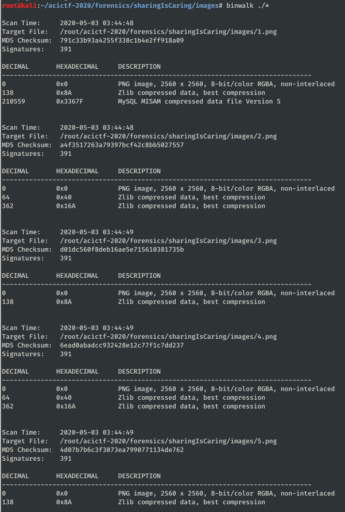

# Sharing is Caring #

**Category:**	Forensics  
**Points:**	250

**Prompt:** 
* Hey Challanger. I know you're putting together that Veteran's Day presentation. Here's all the U.S. service seals straight from Wikipedia. I think you'll only need four of them to get the points across. More than that is just excessive, but it's up to you.
* [files.tgz](./files.tgz)

**Hints:** 
* Research split secret schemes
* Four out of five secrets are required

**Solution:**
* Use unzipper script --ADD SCRIPT-- to unarchive several times
* It lists 5 image files.  Lets do basic stego techniqes
    * File each
        * All are PNGs
    * Binwalk each
        * Possible hidden data
        * 
* Extract the mysql file from 1.png
```
dd if=./1.png of=1_mysql bs=1 skip=210559 count=903289
```

* Before digging into the mysql file, lets just run strings on it
* I got something that might be a secret, seeing as it starts with '1 - '
```
1-18786878512788745873830654777289469073331705035606813377262882446691156899187330252458249424123064136053325675649521435763187595426983824346186898530334353
```

* The zlib streams are normal for .png's, I decided to try exiftool to look in the metadata
```
exiftool ./*
```

* Under the "Artist" tag, files 2 and four had what look like a secret:
```
2-86302117178113637035774694114665566744857871667860557192436717578159465143615994940847231908413189359402782234463287346043802480509173570953052868988526065
4-490954926737699130471220227900391502772533285669433359190877128831830839590950838011884411655438244232442460056051863864567715340629055507170548621865963293
```

* I used strings on 3.png and 5.png and got the following:
```
3-233405028938806492297636443369806756737088423883542362209111476128505750713974379041588966381164174467046941723546730255723791664004659714921283125050611391
5-889811123517623370368330373064098268573702381012314678901323646422235557755233727308934526544297623429045993145130701872340133705097974198620520314583954733
```

* I found a [python script](http://mslc.ctf.su/wp/plaidctf-2012-nuclear-launch-detected-150-password-guessing/) online that can decrypt a split shamir secret.  I struggled to get it working until I realized I needed a random prime number with almost as many bits as one of the secrets.
* I calculated one [here](https://asecuritysite.com/encryption/random3):
* Finished Script:
```
#!/usr/bin/python3

from libnum import *
 
pairs = []
pairs += [(1, 18786878512788745873830654777289469073331705035606813377262882446691156899187330252458249424123064136053325675649521435763187595426983824346186898530334353)]
pairs += [(2, 86302117178113637035774694114665566744857871667860557192436717578159465143615994940847231908413189359402782234463287346043802480509173570953052868988526065)]
pairs += [(3, 233405028938806492297636443369806756737088423883542362209111476128505750713974379041588966381164174467046941723546730255723791664004659714921283125050611391)]
pairs += [(4, 490954926737699130471220227900391502772533285669433359190877128831830839590950838011884411655438244232442460056051863864567715340629055507170548621865963293)]
#pairs += [(5, 889811123517623370368330373064098268573702381012314678901323646422235557755233727308934526544297623429045993145130701872340133705097974198620520314583954733)]
 
 
 # 12th Mersenne Prime
# (for this application we want a known prime number as close as
# possible to our security level; e.g.  desired security level of 128
# bits -- too large and all the ciphertext is large; too small and
# security is compromised)

# For this, just calculate a prime with almost as many bits as one of the secrets
# https://asecuritysite.com/encryption/random3
p = 3121704981293971012055570462048684005536946311849056803415987953779198182223960042796880795678589943231533794236246784699046357279789358395584204741419183
#2 ** 127 - 1 #int(open("p.txt").read())
 
res = 0
for i, pair in enumerate(pairs):
	x, y = pair
	top = 1
	bottom = 1
	for j, pair in enumerate(pairs):
		if j == i:
			continue
		xj, yj = pair
		top = (top * (-xj)) % p
		bottom = (bottom * (x - xj)) % p
	res += (y * top * invmod(bottom, p)) % p
	res %= p
 
print(res)
print(n2s(res))
```
* ACI{2b1cfec1bc2f113a882d6d1a4c2}
