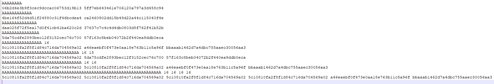
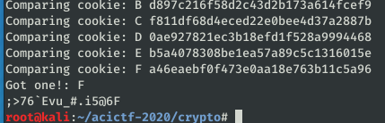
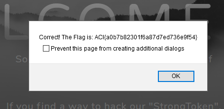

# Speak Plainly #

**Category:**	Cryptography  
**Points:**	150

**Prompt:** 
* There's something suspicious about how account logins happen on this server... ? http://challenge.acictf.com:61982

**Hints:** 
* Your username and the secret strongtoken are the only components of the encrypted cookie
* How does the length of your username effect the length of the cookie?
* It is possible to guess strongtoken one byte-at-a-time because of how AES-ECB works
* The strongtoken itself does not contain any ';' characters


**Solution:**
* 
* Based on the hint, lets try different username lengths and see how it affects the token
* 
* The minimum token length is 32 bytes
* A username length of 16 or greater increases the length of the token by 16 bytes
* Therefore, the current strongtoken that is appended must be 17 bytes long if it has room for 15 bytes before extending a new block. 
* Each block that is completely filled with A's is encrypted to "5c10810fa2f8f1d84c716da704569a02"
* Looking at the token where we entered 32 bytes of A's, we know that the first two 16 byte blocks got completely filled, so what do the other two 16 byte blocks contain?
    * If we change our username to 32 B's instead, the last two blocks are unaffected
* So, if our username is all A's and we use X to represent the appended token, a 15 byte username would get encrypted in blocks like this:
    * AAAAAAAAAAAAAAAX XXXXXXXXXXXXXXXX
* Therefore, if we make a 15 byte username, one char of the strongtoken will get included in the first block.  We will represent null byte padding with 0:
    * AAAAAAAAAAAAAAAX XXXXXXXXXXXXXXXX
* Now we can get the the ciphertext for the first block and compare it to ciphertext for every possible combination of 15 A's plus one other char to discover what it is! Let's get started with this Grind!
    * AAAAAAAAAAAAAAA;  matches the ciphertext so we know that ';' is the first char!  That stupid hint just wasted a lot of my time because I thought I didn't have to check it.
* I wrote a python script to try all possible characters one byte at a time and then tried the 17th char by hand:
```
#!/usr/bin/python3

import requests, re, pprint

pp = pprint.PrettyPrinter()

token = "da75cdfe2893bec12f3152cec76c70057f163c8beb04072b2f440ea9ddb0eca"

header = {
    'auth_token': token,
    '__cfduid': 'd625472fea42b9aeb36bc75d1372e25231587780593',
    '_ga': 'GA1.2.250660782.1587780595',
    'User-Agent': 'Mozilla/5.0 (X11; Linux i686; rv:68.0) Gecko/20100101',
    'Accept': '*/*',
    'Accept-Language': 'en-US,en;q=0.5',
    'Accept-Encoding': 'gzip, deflate',
    'Referer': 'http://challenge.acictf.com:61982/',
    'Content-Type': 'application/x-www-form-urlencoded',
    'X-Requested-With': 'XMLHttpRequest',
    'Cookie': '__cfduid=d625472fea42b9aeb36bc75d1372e25231587780593; _ga=GA1.2.250660782.1587780595; auth_token=5da75cdfe2893bec12f3152cec76c70057f163c8beb04072b2f440ea9ddb0eca'
    }


# The plaintext
finalString = r''

#all possible chars in ascii range for the token
charList = '; 1234567890abcdefghijklmnopqrstuvwxyzABCDEFGHIJKLMNOPQRSTUVWXYZ,<.>/?:\'\\|-_=+)(*&^%$#@!`~}{]['


blockSize=32
padLength = 15-len(finalString)
while padLength > 0:
    print("Plaintext Progress: "+finalString)
    padLength = 15-len(finalString)
    nextUser = str('A'*padLength)
    pload={'username':nextUser,'password':'123'}
    r=requests.post('http://challenge.acictf.com:61982/register',headers=header,data=pload)
    correctCookie = str(r.headers).split('auth_token=')[1].split('; P')[0][0:blockSize-1]
    print("Looking for cookie: "+correctCookie)
    for i in charList:
        nextUser = str('A'*padLength)+finalString+i
        pload={'username':nextUser,'password':'123'}
        #print("Trying Payload: "+str(pload))
        r=requests.post('http://challenge.acictf.com:61982/register',headers=header,data=pload)
        compareCookie = str(r.headers).split('auth_token=')[1].split('; P')[0][0:blockSize-1]
        print("Comparing cookie: "+i+" "+compareCookie)
        if compareCookie == correctCookie:
            print("Got one!: "+i)
            finalString = finalString+i
            break
print(finalString)
```
* The first 16 chars:
* 
* The 17th char was '6' after trying all by hand
* 
* ACI{a0b7b82301f6a87d7ed736e9f54}
