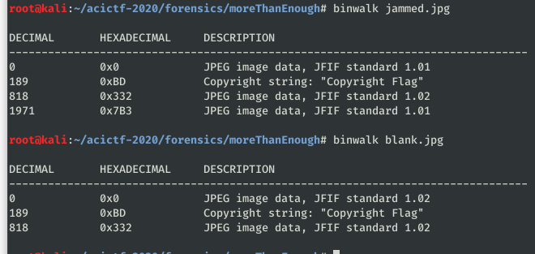
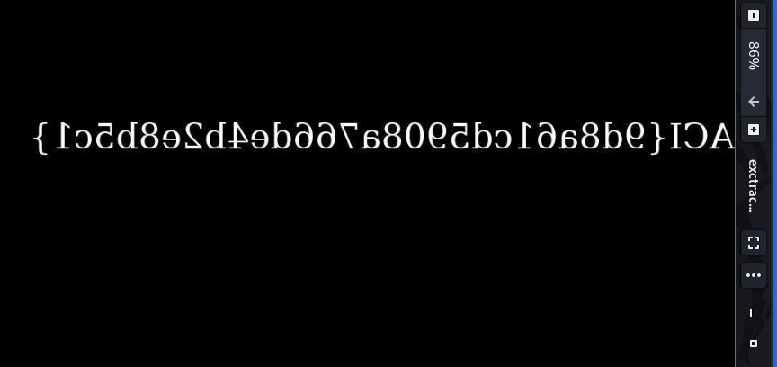

# That's More Than Enough #

**Category:**	Forensics  
**Points:**	100

**Prompt:** 
* We think Jolly Jeff is up to no good. See if you can find the hidden message in his [JPEG Jammer](http://challenge.acictf.com:41830/).

**Hints:** 
* Hex editors, such as bless or wxHexEditor, are great for viewing file contents. Install bless with "sudo apt install bless" or wxhexeditor with "sudo apt install wxhexeditor".
* Take a look at the [JPEG file format](https://en.wikipedia.org/wiki/JPEG_File_Interchange_Format#File_format_structure) specification.

**Solution:**
* We upload and jam an inmage with his tool.  Now lets check both with binwalk:
* 
* It looks like something might have been appended. Lets run dd to extract it.
```
dd if=./jammed.jpg of=./exctracted1.jpg bs=1 skip=1971 count=14034
```
* I got the 14034 by running ls -l to see the total file size and subtracted the offset
* View the extracted file:
    * 
* Reverse it with the online jammer tool:
    * 
* ACI{9d8a61cd5908a766de4b2e8b5c1}
