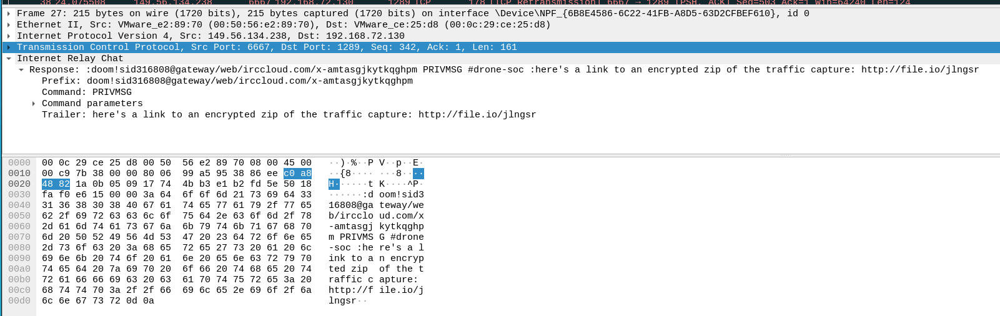
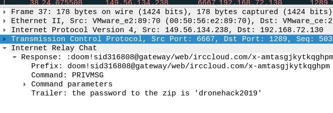
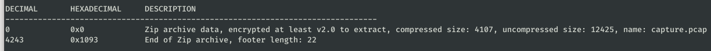

# Turtles All the Way Down #

**Category:**	Forensics  
**Points:**	100

**Prompt:** 
* Early this morning, a breach occurred on the server hosting our next-gen drone development repository. It is your job to figure out what was taken:
* [challenge.zip](./challenge.zip)

**Hints:** 
* Our analysts are using IRC to share information and investigate this breach
* Everything you need lives within these PCAP's, you simply need to carve out the relevant files
* These ZIPS appear to have been generated with 7z
* FTP is a simple text-based protocol, with passive binary streams for file transfers

**Solution:**
* Unzip and open in wireshark scroll through the IRC conversation
    * They sent a link for the encrypted pcap:
    * 
    * They also send the password:
    * 
* One of the users downloads the file. Lets extract it from the capture
    * Go to file -> export objects -> http -> download the target [file](./jlngsr)
* Unzip isn't working for some reason, it says unexpected EOF
* Look at binwalk
    * 
* I just downloaded to windows and used gui 7z and it prompted me for password and opened
* Read flag.txt
* ACI{df249275e2acff50bd5ea272934}
