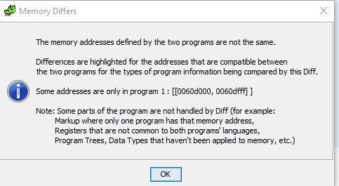
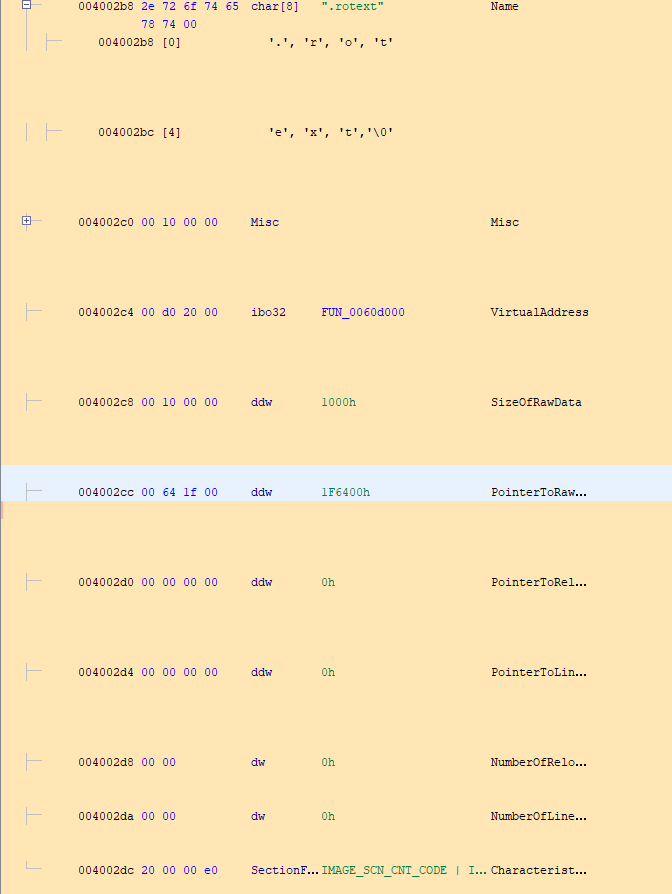
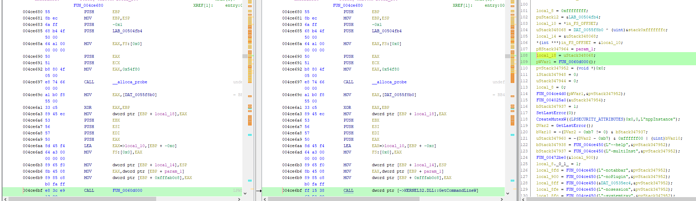
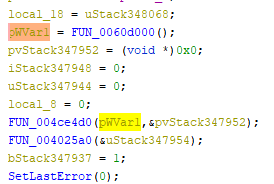
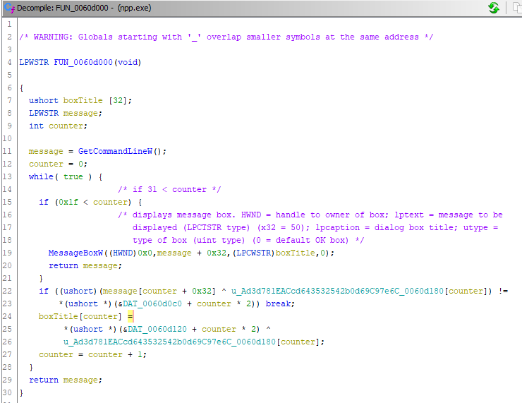

# What's the Difference #

**Category:**	Reverse Engineering  
**Points:**	100

**Prompt:** 
* Of course it's safe to download programs ([npp.6.8.7.bin.minimalist.7z](./npp.6.8.7.bin.minimalist.7z)) from the internet. Although the official archive from https://notepad-plus-plus.org/repository/6.x/6.8.7/npp.6.8.7.bin.minimalist.7z is different ([official.npp.6.8.7.bin.minimalist.7z](./official.npp.6.8.7.bin.minimalist.7z))...

**Hints:** 
* Maybe the binary has been modified.
* You can try using BinDiff, Diaphora, or Ghidra's Program Differences Tool on npp.exe and notepad++.exe.

**Solution:**
* I used Ghidras Differences module:
* 
* 
* 
* 
* GetCommandLineW function - Retrieves the command-line string for the current process.
* Original notepad++ doesn't have this function at all
* 
* LPWSTR type - 32-bit pointer to a string of 16-bit Unicode characters, which MAY be null-terminated. The LPWSTR type specifies a pointer to a sequence of Unicode characters, which MAY be terminated by a null character (usually referred to as "null-terminated Unicode").
*  MessageBox function - Displays a modal dialog box that contains a system icon, a set of buttons, and a brief application-specific message, such as status or error information. The message box returns an integer value that indicates which button the user clicked.
* DAT_0060d0c0
```
000027007a001f0003005c000500240071002000560056000500030057000100520004000200510056005500060056000400580070000f005200000003003e000000000038635000000000000000000000000000000000000000000000000000
```
* Account for counter * 2 (get rid of every other byte)
```
00277a1f035c0524712056560503570152040251565506560458700f5200033e00003850000000000000000000000000
```
* DAT_0060d120
```
0f000b00470044005500590055006e006a00630017000c0053001400550059005200550015005d004100580010004400160019006300190017004500160063000000000000000000000000000000000000000000000000000000000000000000
```
* Account for counter * 2 (get rid of every other byte)
```
0f0b47445559556e6a63170c531455595255155d41581044161963191745166300000000000000000000000000000000
```
* Random xor utf string in ascii and hex
```
u'Ad3d781EACcd643532542b0d69C97e6C'
4164336437383145414363643634333533323534326230643639433937653643
```
* XOR modified DAT_0060d120 and random string
```
4e6f74206261642b2b2074686520666c61672069733a20202020202020202020
```
* To ascii
    * Not bad++ the flag is:
* XOR modified DAT_0060d120 and random string
```
4143497b3464346130633532333764346136376564373632326133366565357d
```
* To ascii
    * ACI{4d4a0c5237d4a67ed7622a36ee5}

